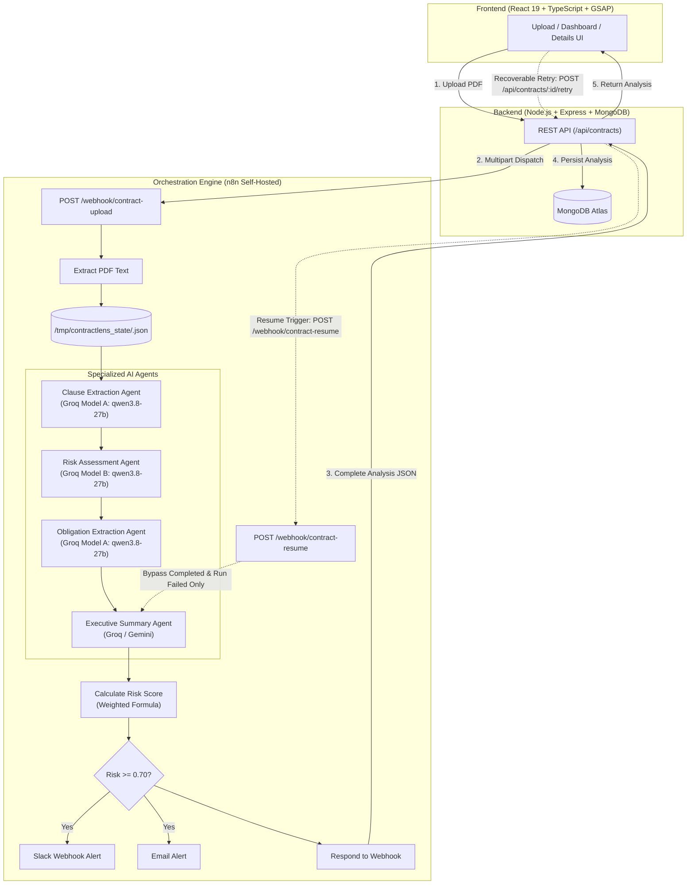
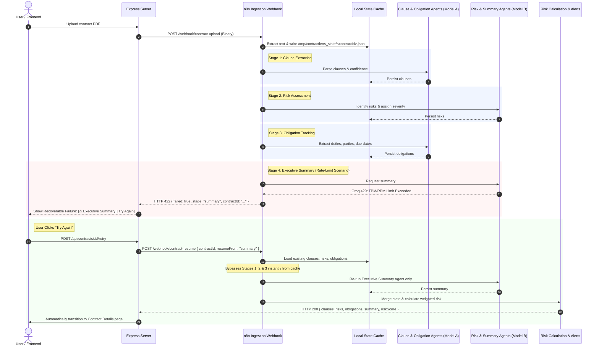

# ContractLens 🔍⚖️
> **Autonomous Multi-Agent Legal Intelligence Platform with Resumable Orchestration & Deterministic Risk Scoring**

ContractLens transforms lengthy, high-risk PDF legal agreements into actionable insights in seconds. Powered by **dual Groq Cloud LLMs**, **Google Gemini**, an **event-driven n8n workflow engine**, an **Express/TypeScript/MongoDB** backend, and a high-performance **React 19 + GSAP + Tailwind CSS** frontend.

---

## 📸 Product Interface & Visuals

### 1. Landing & Document Perception


### 2. Interactive Navigation Overlay


### 3. Real-Time Risk Dashboard


### 4. Deep-Dive Risk Evaluation & Actionable Recommendations


### 5. Multi-Agent Resumable n8n Pipeline


---

## 🌟 Key Innovations & Capabilities

- 🤖 **Multi-Agent Cognitive Pipeline**: Rather than relying on a single monolithic prompt, analysis is partitioned across **four specialized agents** (Clause Extraction, Risk Assessment, Obligation Extraction, Executive Summary).
- ⚡ **Fault-Tolerant Resumable Agent Architecture**: Built-in state caching prevents workflow restarts. If any downstream AI agent hits an API rate limit (e.g. Groq 429), prior stages are preserved on disk. Users can click **[ Try Again ]** to resume *only* the failed agent and complete analysis in milliseconds.
- 📐 **Deterministic Risk Scoring Algorithm**: Moves beyond arbitrary LLM opinions with a mathematical clause-weight matrix combined with missing-clause and low-confidence penalties.
- 🔔 **Multi-Channel Alerting**: Contracts exceeding risk thresholds automatically dispatch high-priority notifications to **Slack** and **Email**.
- 📋 **Automated Obligation Tracking**: Automatically parses actionable duties, responsible parties, and statutory timelines for post-signature compliance.

---

## 🏛️ End-to-End System Architecture



---

## 🔄 Detailed n8n Resumable Agent Pipeline Flow



---

## 📊 Deterministic Risk Scoring Model

The risk calculation engine evaluates risk using an objective weighted matrix:

$$\text{Overall Risk} = \sum (\text{Clause Score} \times \text{Clause Weight}) + \text{Missing Clause Penalties} + \text{Low Confidence Flags}$$

### 1. Clause Weight Distribution
| Clause Domain | Weight | Clause Domain | Weight |
| :--- | :---: | :--- | :---: |
| **Limitation of Liability** | `0.22` | **Data Protection & Security** | `0.18` |
| **Service Level & Support** | `0.16` | **Indemnification** | `0.10` |
| **Term & Termination** | `0.10` | **Fees & Payment Terms** | `0.08` |
| **Intellectual Property** | `0.08` | **Confidentiality** | `0.05` |
| **Effect of Termination** | `0.02` | **Governing Law / Jurisdiction**| `0.01` |

### 2. Severity Scoring Multipliers
- **Critical Risk**: `1.00`
- **High Risk**: `0.75`
- **Medium Risk**: `0.50`
- **Low Risk**: `0.25`
- **None**: `0.00`

---

## 🛠️ Tech Stack & Architecture

### **Frontend**
- **Framework**: React 19, TypeScript, Vite
- **Styling**: Tailwind CSS v4
- **Animation & Transitions**: GSAP (GreenSock), `@gsap/react`
- **Icons**: Lucide React
- **Routing**: React Router v7

### **Backend**
- **Runtime**: Node.js, Express, TypeScript (`tsx`)
- **Database**: MongoDB Atlas via Mongoose
- **File Ingestion**: Multer & Form-Data
- **HTTP Client**: Axios

### **AI & Workflow Orchestration**
- **Engine**: n8n Self-Hosted (Docker)
- **Primary LLM Model A**: Groq Cloud Chat Model (`qwen/qwen3.8-27b`)
- **Primary LLM Model B**: Groq Cloud Chat Model (`qwen/qwen3.8-27b`)
- **Secondary Model**: Google Gemini Chat Model
- **Document Parser**: n8n Native PDF Extraction
- **Notifications**: Slack Webhook, Gmail/SMTP

---

## 🚀 Getting Started

### Prerequisites
- [Node.js](https://nodejs.org/) (v20+ recommended)
- [Docker Desktop](https://www.docker.com/) (for n8n self-hosting)
- [MongoDB Atlas](https://www.mongodb.com/atlas) connection string
- [Groq API Key](https://console.groq.com/) and [Gemini API Key](https://aistudio.google.com/)

---

### Step 1: Clone the Repository
```bash
git clone https://github.com/your-username/ContractLens.git
cd ContractLens
```

---

### Step 2: Configure Environment Variables

#### **Backend (`Backend/.env`)**
```env
PORT=5000
MONGODB_URI=your_mongodb_connection_string
CLIENT_ORIGIN=http://localhost:5173
N8N_WEBHOOK_URL=http://localhost:5678/webhook/contract-upload
N8N_RESUME_WEBHOOK_URL=http://localhost:5678/webhook/contract-resume
```

#### **Frontend (`Frontend/.env`)**
```env
VITE_API_URL=http://localhost:5000
```

---

### Step 3: Run the n8n Container
```bash
docker run -d --name n8n -p 5678:5678 -v n8n_data:/home/node/.n8n docker.n8n.io/n8nio/n8n
```
Import the provided `n8n_workflows.json` into your local n8n instance at `http://localhost:5678`.

---

### Step 4: Start Backend & Frontend

#### Terminal 1 — Backend:
```bash
cd Backend
npm install
npm run dev
```
*Backend runs on `http://localhost:5000`*

#### Terminal 2 — Frontend:
```bash
cd Frontend
npm install
npm run dev
```
*Frontend runs on `http://localhost:5173`*

---

## 📂 Project Structure

```text
ContractLens/
├── Backend/
│   ├── src/
│   │   ├── config/          # Database connection
│   │   ├── controllers/     # Contract analysis, CRUD, retry logic
│   │   ├── middleware/      # Multer file upload handlers
│   │   ├── models/          # Mongoose schema (Clauses, Risks, Obligations)
│   │   ├── routes/          # Express route definitions
│   │   ├── app.ts           # Express configuration & CORS
│   │   └── server.ts        # Server bootstrap
│   └── package.json
│
├── Frontend/
│   ├── src/
│   │   ├── assets/          # Static assets & illustrations
│   │   ├── components/      # UI components (Buttons, Cards, Header)
│   │   ├── pages/           # Dashboard, UploadContract, ContractDetail
│   │   ├── services/        # Typed API clients & error handlers
│   │   └── App.tsx          # Application shell & routes
│   └── package.json
│
├── readme-images/           # Product screenshots & workflow visual
│   ├── Screenshot 2026-09-20 154111.png  # Landing Hero
│   ├── Screenshot 2026-09-20 154121.png  # Navigation Menu
│   ├── Screenshot 2026-09-20 154134.png  # Contracts Dashboard
│   ├── Screenshot 2026-09-20 154157.png  # Risk Detail Analysis
│   └── Screenshot 2026-09-20 154359.png  # n8n Workflow Graph
│
├── n8n_workflows.json       # Complete exportable n8n workflow
└── README.md
```

---

## 🛡️ License

This project is licensed under the **ISC License**.
